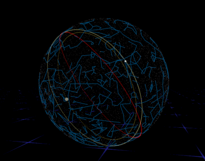

# [WIP] WebVR SkyMap

WebVRで星空を表示するやつです

DEMO: https://binzume.github.io/webvr-skymap/

- WebVR対応ブラウザ + コントローラが必要です (Oculus Go/Questで動作確認)
- 太陽と月が表示されていますが，地球と月の共通重心から見てるので日食などは不正確です

## 元データなど

- 恒星のデータはヒッパルコス星表を使っています
  - https://heasarc.gsfc.nasa.gov/db-perl/W3Browse/w3table.pl?tablehead=name%3Dhipparcos&Action=More+Options
  - 上のサイトから6.5等級未満のものを取得しました
- 星座線は http://astronomy.webcrow.jp/hip/
- 地球の歳差運動は P03 モデルのパラメータで計算

## TODO

- 星座名・星座境界
- 惑星の表示

# License

T.B.D.
