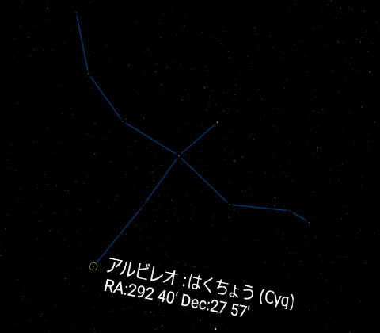

# WebVR SkyMap

WebVR/XRで星空を表示するやつです．実際の星空に近い見た目を目指しています．(Oculus Go/Questで動作確認, おそらくHTC Vive + Firefoxでも動作します)

Live DEMO: https://binzume.github.io/webvr-skymap/

- 6等星までの恒星と，太陽系の惑星と月と太陽を表示します
- WebVR対応ブラウザ + コントローラが必要です
- 太陽と月が表示されていますが，地球と月の共通重心から見てるので日食などは不正確です

## TODO

- 検索機能
- まともなUI

## 利用しているデータ

- 恒星のデータはヒッパルコス星表を使っています
  - https://heasarc.gsfc.nasa.gov/db-perl/W3Browse/w3table.pl?tablehead=name%3Dhipparcos&Action=More+Options
  - 上のサイトから6.5等級未満のものを取得
- 惑星の軌道要素は https://ssd.jpl.nasa.gov/?planet_pos
- 星座情報は http://astronomy.webcrow.jp/hip/
- 地球の歳差運動のパラメータは IAU2006(P03) のものから必要な係数を取得

データを再利用する場合も，各データのライセンスに従ってください．

# License

dataディレクトリ以外のソースコードは MIT License です．
